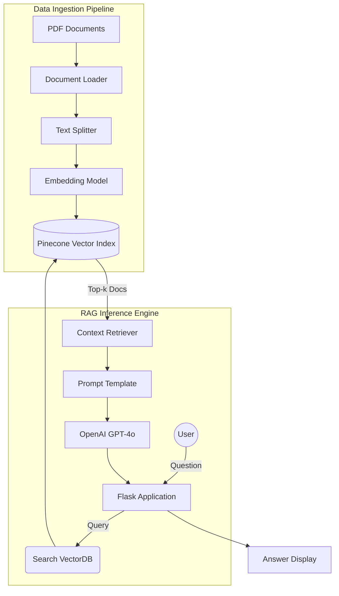

# Docucure-Assistant-Engine

**Overview**

The Medical Chatbot System is a modular, Python-based RAG (Retrieval-Augmented Generation) architecture designed to provide accurate medical answers. By processing PDF medical documents, the system utilizes a pipeline of specialized components to retrieve context and generate safe, concise responses using OpenAI's GPT-4.

**Key Features**

*   **Modular Architecture**: Clear separation of concerns between ingestion, retrieval, and configuration.
*   **Vector Search**: Utilizes Pinecone serverless indexing for fast and scalable similarity search.
*   **Intelligent Retrieval**: Uses LangChain to orchestrate the RAG pipeline with context-aware prompting.
*   **Dynamic Configuration**: Centralized management of credentials and settings.
*   **Clean Data Processing**: Sanitizes metadata and splits documents for optimal embedding performance.

**Project Structure**

```
medical-chatbot-system/
├── src/
│   └── medical_bot/          # Main package source code
│       ├── __init__.py
│       ├── config.py         # Configuration & Secrets
│       ├── ingestion.py      # ETL Pipeline (Load -> Split -> Embed)
│       ├── retrieval.py      # RAG Chain Construction
│       ├── formatting.py     # Data Cleaning Utilities
│       └── prompts.py        # LLM System Prompts
├── data/                     # Input PDF documents directory
├── templates/                # HTML Templates for Flask
│   └── chat.html
├── run_app.py                # Chat Interface Entry Point
├── run_ingest.py             # Data Ingestion Entry Point
└── requirements.txt          # Project dependencies
```

**Installation**

1.  **Clone the repository:**
    ```bash
    git clone <repository-url>
    cd medical-chatbot-system
    ```

2.  **Install dependencies:**
    ```bash
    pip install -r requirements.txt
    ```

**Usage**

1.  **Configure Environment:**
    Ensure your `.env` file is set up:
    ```ini
    PINECONE_API_KEY=...
    OPENAI_API_KEY=...
    ```

2.  **Ingest Data:**
    Process your PDF files in the `data/` directory:
    ```bash
    python run_ingest.py
    ```

3.  **Run the System:**
    Launch the chat interface:
    ```bash
    python run_app.py
    ```

**Data Flow**

The system follows a pipeline coordinated by the RAG Orchestrator:



**Components**

*   **Ingestion Engine**: Loads PDFs, cleans metadata, and upserts vectors to Pinecone.
*   **Retrieval Module**: Constructs the LangChain RAG pipeline.
*   **Config Manager**: Validates and provides environment variables.
*   **Flask Interface**: Simple web UI for interacting with the bot.

**Author**

Shivam Raj
